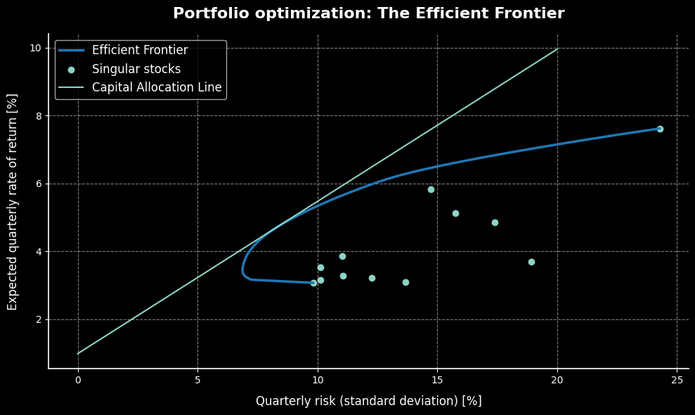

# Markowitz Model Portfolio Optimization

The aim of this project was to find the optimal weights for a portfolio consisting of 12 stocks.



# Description

According to the Modern Portfolio Theory Expected Return $E(R_p)$ and Variance $\sigma^2_p$ are given by formulas

$$
\begin{align*}
E(R_p) = \boldsymbol{w}^{\top}\boldsymbol{\mu}, \\
\sigma^2_p = \boldsymbol{w}^{\top}\boldsymbol{\Sigma}\boldsymbol{w},
\end{align*}
$$

where $\boldsymbol{w}$ is a vector of weights, $\boldsymbol{\mu}$ is a vector of expected returns on single stocks and $\boldsymbol{\Sigma}$ is a covariance matrix.
Optimization was performed by minimizing risk (variance) for given expected returns (between returns of the best and the least performing stocks). Optimized portfolios formed an efficient frontier which allowed to find the Capital Allocation Line and the Sharpe Ratio $S$ defined by

$$
S = \frac{R_j - R_f}{\sigma_j},
$$

where $R_j$ is a rate of return of a portfolio, $R_f$ is a risk free rate of return and $\sigma_j$ is the standard deviation of the portfolio.
Data was retrieved using `yfinance` and analyzed using `pandas` and `scipy`. 

# Data and assumptions

- **Analyzed stocks**: AAPL, MSFT, IBM, KO, PG, WMT, JNJ, PFE, XOM, CAT, JPM, BAC
- **Timeframe** is 1990-01-01 to 2026-04-18
- **Interval** Quarterly
- Long only positions
- Annualized **risk free rate** 
is 4%
- Portfolio is **fully invested**

# Results
The Maximum Sharpe Ratio achieved was 0.45, yielding an expected return of 4.70% with a standard deviation 8.28%.

# Setup and Execution
To run this project, you will need Python installed along an IDE that supports `.ipynb` e.g. VS Code).

**1. Clone the repository**
Open your terminal and clone this repository to your local machine:
```bash
git clone https://github.com/Dziobakk/PortfolioOptimization_MPT.git
cd PortfolioOptimization_MPT
```
**2. Install dependencies**
Install the required Python libraries using the provided `requirements.txt` file:
```bash
pip install -r requirements.txt
```
